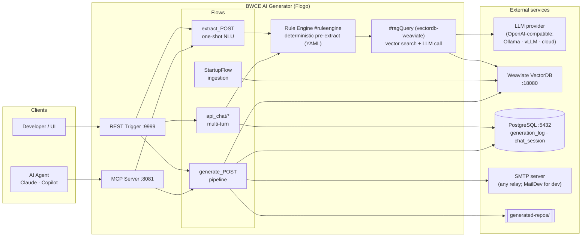
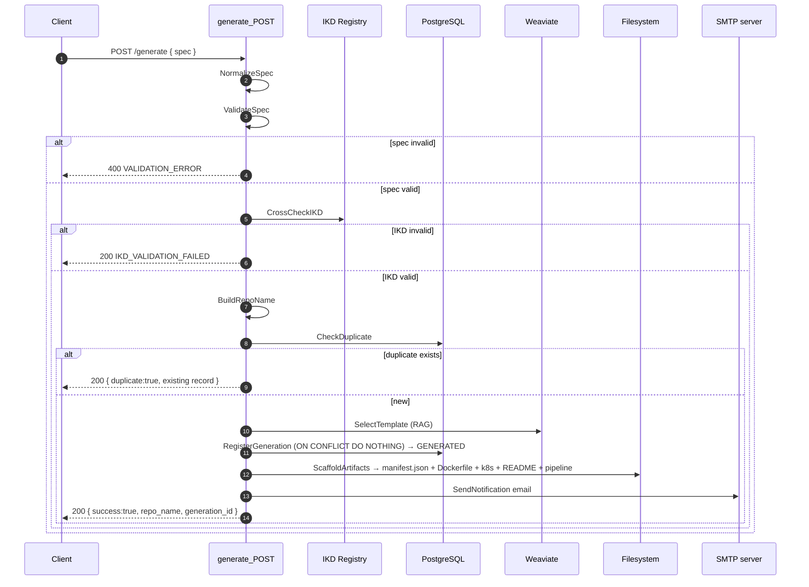
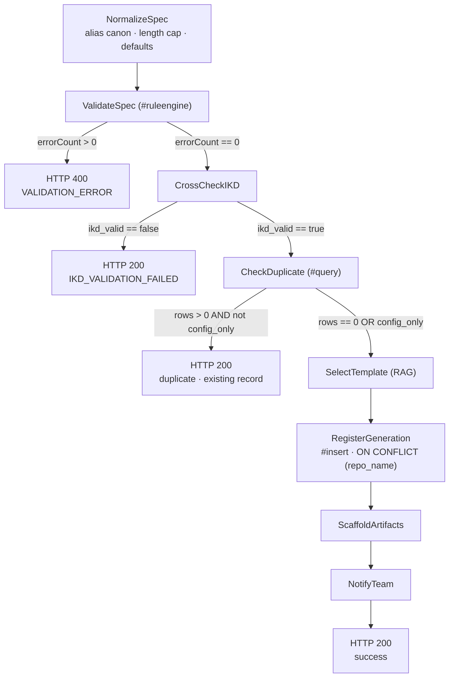

# BWCE AI Generator — Flogo Agentic AI

AI-powered accelerator that generates production-ready **TIBCO BWCE integration repositories** from plain-English requirements, built entirely on **TIBCO Flogo Agentic AI**.

It combines a deterministic rule engine, an LLM for natural-language understanding, Weaviate vector search for template selection, and PostgreSQL for an idempotent generation registry — exposed over both a REST API and an MCP server.

---

## Highlights

- **Conversational & one-shot spec extraction** — describe an integration in English; the system extracts a structured BWCE spec.
- **Deterministic pre-extraction** — a YAML rule engine pulls high-confidence signals (IKD ids, systems, env) before the LLM runs, improving accuracy and making small local models viable.
- **Fence-tolerant JSON parsing** — LLM responses wrapped in prose / ```code fences``` are sanitized before parsing, so models like `llama3.1:8b` work reliably.
- **IKD cross-check** — `interface_id` / `scenario_id` are validated against the IKD registry before anything is generated.
- **Template RAG** — the best-matching template is selected via Weaviate vector search.
- **Idempotent generation** — duplicate specs return the existing record instead of re-scaffolding.
- **Repo scaffolding** + **notification email** on success.
- **Dual interface** — REST API (`:9999`) and MCP server (`:8081`) for Claude / Copilot agents.

---

## Architecture



### `generate_POST` pipeline (the headline flow)



#### Governance gates (decision flow)

The pipeline is a chain of conditional gates — each either lets the request proceed or short-circuits to a reply, so **no side effect happens until every gate passes**:



| Gate | Check | On fail |
|------|-------|---------|
| **Validation** | `ValidateSpec.errorCount == 0` (rule pack) | **400** `VALIDATION_ERROR` — fail fast, no writes |
| **IKD cross-check** | `ikd_valid == true` | **200** `IKD_VALIDATION_FAILED` |
| **Idempotency** | no existing `repo_name` *(unless `config_only`)* | **200** returns the existing record |
| **Race-safety** | `UNIQUE(repo_name)` + `ON CONFLICT DO NOTHING` | concurrent duplicates collapse to 1 row |

> Any runtime fault (e.g. PostgreSQL down) is caught by a flow-level error handler → structured **500** `{error, activity, code}`.

---

## API Endpoints

| Method | Path | Description |
|--------|------|-------------|
| GET  | `/` | Web chat UI |
| GET  | `/health` | Health check |
| GET  | `/docs` | Interactive API reference |
| GET  | `/openapi.json` | OpenAPI 3.0 spec |
| GET  | `/api/templates` | List available BWCE templates |
| POST | `/api/chat/init` | Initialize a chat session |
| POST | `/api/chat/message` | Conversational spec extraction |
| POST | `/api/chat/reset` | Reset a session |
| POST | `/extract` | One-shot NLU extraction |
| POST | `/generate` | Generate a BWCE repository |

MCP tools (`:8081`): `extract_spec`, `generate_code`, `list_templates`.

---

## Flows

| Flow | Purpose |
|------|---------|
| `StartupFlow` | Loads the template registry + IKD ids, ingests templates into Weaviate, initializes the PostgreSQL `generation_log` + `chat_session` tables |
| `api_chat/*` | Multi-turn conversational spec gathering (session state persisted in PostgreSQL `chat_session`) |
| `extract_POST` | One-shot NLU extraction (deterministic pre-extract + LLM) |
| `generate_POST` | Validate → IKD cross-check → template RAG → register → scaffold → notify |
| `MCPExtractSpecTool`, `MCPGenerateTool`, `MCPListTemplates` | MCP-exposed tools |

---

## Prerequisites

| Service | Where | Port | Notes |
|---------|-------|------|-------|
| TIBCO Flogo CLI (`fcli`) | host | — | build context `flogo-studio-2264` (2.26.4) |
| PostgreSQL | container `flogo-studio-postgres` | 5432 | db `flogo_agent_studio`, user `flogo` |
| Weaviate | container `weaviate` | 18080 | template RAG collection `BWCETemplates768` |
| **SMTP server** | any relay | 1025 | **MailDev** is the local-dev default (mock SMTP + web inbox at :1080); point `SMTP_HOST`/`SMTP_PORT` at any relay |
| **LLM provider** | any OpenAI-compatible API | 11434 | **Ollama** is the local-dev default (`llama3.1:8b`, `nomic-embed-text`); swap in vLLM, LM Studio, or a cloud LLM |

> **Pluggable backends:** the LLM and the SMTP relay are *not* hard-wired — Ollama and MailDev are only the
> local-dev defaults. Point `LLM_Base_URL` at any OpenAI-compatible endpoint and `SMTP_HOST`/`SMTP_PORT` at any
> SMTP server; nothing else changes.

---

## Quick start (demo)

Two helper scripts under [`demo/`](demo/) bring everything up and walk through the solution.

```bash
# 1. Start every prerequisite (Postgres, Weaviate, MailDev, Ollama) + the app.
#    Add --build to compile the binary first.
./demo/start-demo.sh            # or: ./demo/start-demo.sh --build

# 2. Run the guided, narrated walkthrough (pauses before each step).
./demo/run-demo.sh              # or: ./demo/run-demo.sh --auto

# Stop the app + MailDev when finished (shared services stay up).
./demo/start-demo.sh --stop
```

Once running:

- REST API → http://localhost:9999
- MCP server → http://localhost:8081
- MailDev inbox → http://localhost:1080
- App log → `/tmp/bwce-ai-generator.log`

---

## Build (manual)

```bash
fcli build-exe -f bwce-ai-generator.flogo -c flogo-studio-2264 -n bwce-ai-generator -o .
```

## Run (manual)

```bash
./bwce-ai-generator
# REST API on :9999, MCP server on :8081
```

---

## Configuration

App properties (set via Flogo app properties or environment overrides):

| Property | Description | Default |
|----------|-------------|---------|
| `AgenticAI.LLMProvider.LLM_Base_URL` | LLM endpoint — any OpenAI-compatible API (Ollama / vLLM / cloud) | `http://localhost:11434` |
| `LLM_MODEL` | LLM model name (provider-specific) | `llama3.1:8b` |
| `LLM_EMBEDDING_MODEL` | Embedding model | `nomic-embed-text` |
| `VECTOR_COLLECTION` | Weaviate collection | `BWCETemplates768` |
| `RULES_PATH` | Rules directory | `rules/` |
| `TEMPLATE_REGISTRY` | Template list file | `config/templates.json` |
| `SMTP_HOST` / `SMTP_PORT` | Notification relay | `localhost` / `1025` |
| `NOTIFY_SENDER` / `NOTIFY_RECIPIENTS` | Email from / to | `bwce-generator@adidas.com` / `core-integration@adidas.com` |
| `SCAFFOLD_OUTPUT_DIR` | Scaffold output | `generated-repos` |
| `PostgreSQL.GenerationRegistry.Database_Name` | Registry DB | `flogo_agent_studio` |

---

## Test

```bash
# Full REST API test suite (assumes the app is already running on :9999)
bash test/api-test.sh
```

The `generation_log` registry can be reset between demos with:

```bash
docker exec flogo-studio-postgres psql -U flogo -d flogo_agent_studio -c 'TRUNCATE generation_log;'
```
